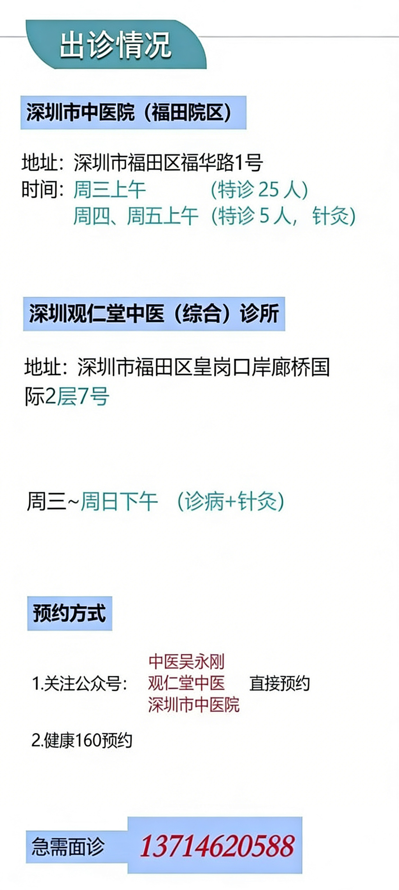
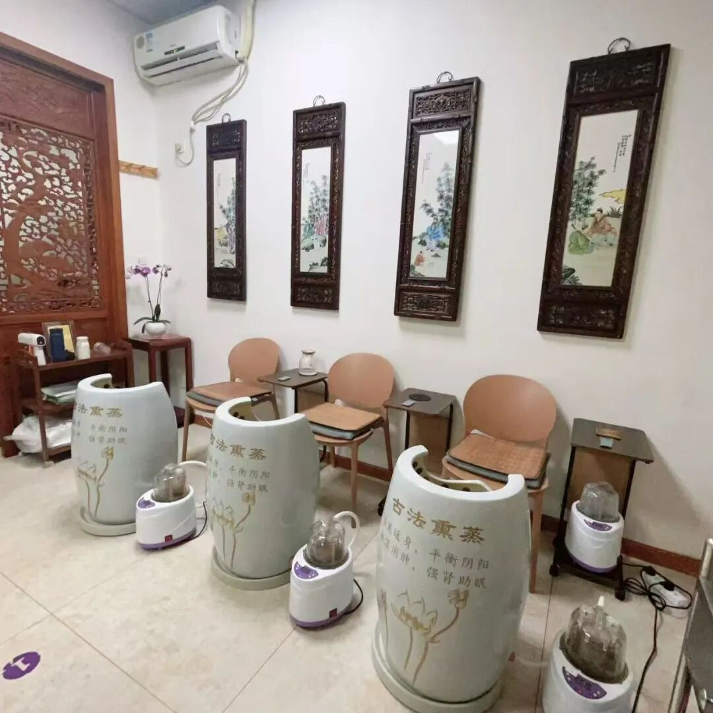

# 观仁堂中医公众号文章生成器

**一站式完成**：选题 → 写文章 → 配图 → 输出成品

## 配置

| 配置项 | 默认值 | 说明 |
|-------|--------|------|
| `output_dir` | `{当前工作目录}/articles` | 文章输出目录 |
| `api_key` | 见下方优先级 | 智谱 API Key |
| `skill_dir` | `~/.claude/skills/guanrentang-writer` | Skill 安装目录 |

### 输出目录设置

**方式一：使用默认路径**
- 不指定时，自动输出到 `{当前工作目录}/articles/`

**方式二：用户指定路径**
- 对话中说 "输出到 ~/Desktop/my-article" 或 "保存到 ./output"
- AI 会使用用户指定的路径

### API Key 配置优先级

1. 环境变量 `ZHIPU_API_KEY`
2. `{skill_dir}/.env` 文件中的 `ZHIPU_API_KEY`

### 首次使用配置

**步骤 1**：获取智谱 API Key
- 访问 [智谱开放平台](https://open.bigmodel.cn/) 注册并获取 API Key

**步骤 2**：选择配置方式（二选一）

| 方式 | 命令 | 说明 |
|-----|------|------|
| **方式一：环境变量** | 在 `~/.zshrc` 或 `~/.bashrc` 中添加 `export ZHIPU_API_KEY=your_key` | 全局可用，适合多个项目 |
| **方式二：.env 文件** | 在 skill 目录下创建 `.env` 文件，内容为 `ZHIPU_API_KEY=your_key` | 仅此 skill 使用，已加入 .gitignore |

> **执行前检查**：如果未配置 API Key，应提示用户选择上述方式之一配置后再继续

## 固定素材

公众号文章开头和结尾需要固定图片（存放在 `{skill_dir}/assets/` 目录）：

| 文件名 | 用途 | 说明 |
|-------|------|------|
| `header-decorative.jpg` | 开头装饰图 | 文章开头装饰性图片 |
| `gufa-xunzheng-cover.jpg` | 古法熏蒸封面 | 古法熏蒸推广文章专用封面图 |
| `holiday-notice-cover.jpg` | 放假通知封面 | 放假通知文章专用封面图 |
| `biyantie-product.webp` | 鼻炎贴产品图 | 鼻宝宝鼻炎贴产品包装照片 |
| `biyantie-detail.png` | 鼻炎贴详情图 | 鼻宝宝鼻炎贴产品详情/使用说明图 |
| `ending-thanks.jpg` | 感谢图 | "您点的每个赞，我都认真当成了喜欢" + 中国传统元素 |
| `ending-divider.jpg` | 分隔装饰图 | 感谢图后的装饰性分隔图 |
| `ending-follow.png` | 关注引导图 | "关注我们" 引导图 |
| `ending-qrcode.jpg` | 二维码图 | "微信扫一扫 关注该公众号" + 公众号二维码 |

> **首次使用**：需要将这些图片放入 `{skill_dir}/assets/` 目录

## 公众号图片尺寸规范

| 位置 | 推荐尺寸 | 比例 | GLM-Image size | 备注 |
|------|---------|------|----------------|------|
| 正文配图 | 1080×810 px | 4:3 | `1472x1088` | AI 生成 |
| 食疗图 | 1080×1080 px | 1:1 | `1280x1280` | AI 生成 |
| 开头装饰图 | - | - | - | **固定素材** |
| 结尾系列图 | - | - | - | **固定素材**（4张） |

> **注意**：GLM-Image 尺寸需为 32 的整数倍，范围 512-2048

## 使用方式

| 用户说 | 效果 |
|-------|------|
| "帮我写一篇文章" | 自动选题，输出到默认目录 |
| "写个春季养生的" | 指定主题，输出到默认目录 |
| "随机写一篇" | 随机选题，输出到默认目录 |
| "古法熏蒸" / "写个熏蒸广告" | 固定主题：古法熏蒸推广文章 |
| "鼻炎贴" / "写个鼻炎贴广告" / "鼻炎推广" | 固定主题：鼻炎贴推广文章 |
| "放假通知" / "写个放假通知" | 固定主题：放假通知（仅正文图片，用户提供） |
| "输出到 ~/Desktop" | 使用指定输出目录 |
| "保存到 ./my-articles" | 使用相对路径 |
| "只写文章" | 写文章但不配图（草稿模式） |

---

## 执行流程

### Step 1: 选题

1. 用户说"古法熏蒸"/"熏蒸广告" → **固定主题：古法熏蒸推广**
2. 用户说"鼻炎贴"/"鼻炎贴广告"/"鼻炎推广" → **固定主题：鼻炎贴推广**
3. 用户说"放假通知"/"假期通知" → **固定主题：放假通知**
4. 用户指定其他主题 → 使用指定主题
4. 用户未指定 → 根据当前月份/节气自动选择（参考 STYLE.md 主题库）
5. 用户说"随机" → 从主题库随机选

**生成文件名**：使用日期前缀 + 文章标题（中文）
- 格式：`YYYY-MM-DD-文章标题.md`
- 例：`2026-03-22-清明养生：养肝明目，踏青防过敏.md`
- 例：`2026-03-19-回南天祛湿大作战.md`
- 图片目录：`images/文章标题/`（不带日期前缀）

### Step 2: 创建输出目录

```bash
# 创建文章和图片目录
mkdir -p "${OUTPUT_DIR}/images/${ARTICLE_TITLE}/"

# 复制固定素材到输出目录
cp -r "${SKILL_DIR}/assets" "${OUTPUT_DIR}/"
```

> **注意**：`SKILL_DIR` 默认为 `~/.claude/skills/guanrentang-writer`

### Step 3: 写文章 + 智能标记配图位置

按照 `STYLE.md` 中的风格撰写文章：
- 字数：1000-1500 字
- 结构：开头 → 原理 → 分点实操 → 注意事项 → 结尾
- 必须包含：中医理论 + 食疗方 + 穴位/注意事项
- 固定结尾语："您点的每个赞，我都认真当成了喜欢"

**智能配图规则**（根据文章内容自动判断）：

| 配图位置 | 触发条件 | 处理方式 |
|---------|---------|----------|
| **开头装饰** | 必有 | **固定素材**：header-decorative.jpg |
| **原理配图** | 有"中医认为"/理论段落 | AI 生成：根据理论内容（如"肝主疏泄"→肝脏示意） |
| **实操配图** | 每个实操要点后 | AI 生成：根据要点内容（穴位→穴位图，食疗→食材图） |
| **食疗特写** | 有具体食疗方 | AI 生成：食疗方名称 + 主要食材 |
| **结尾图** | 必有 | **固定素材**：使用已复制的 `assets/` 目录图片 |

**配图数量控制**：
- 1000 字文章：3-4 张 AI 图 + 1 张开头 + 4 张结尾 = 8-9 张
- 1200 字文章：4-5 张 AI 图 + 1 张开头 + 4 张结尾 = 9-10 张
- 1500 字文章：5-6 张 AI 图 + 1 张开头 + 4 张结尾 = 10-11 张

**文章中标记图片位置**（使用 .jpg/.png 格式）：

```markdown


## 正文开头
...


## 理论原理
...


## 食疗方推荐
...


您点的每个赞，我都认真当成了喜欢





```

> **重要**：
> - 内容配图（配图、食疗）使用 AI 生成，alt 文本描述图片内容用于生成 Prompt
> - 开头和结尾图使用固定素材，路径为 `./assets/`（相对于文章目录）
> - 图片不需要 `<center>` 标签，在微信编辑器中手动居中即可

### Step 4: 保存文章草稿

保存文章到 `${OUTPUT_DIR}/YYYY-MM-DD-{文章标题}.md`

- 文件名格式：日期前缀 + 文章标题（中文）
- 图片目录：`images/{文章标题}/`（不带日期前缀）

### Step 5: 自动生成配图

**执行时机**：文章写完并保存后，立即开始配图

**自动化流程**：

1. **解析文章**：提取所有 `` 格式的图片标记
2. **生成 Prompt**：根据图片类型和描述自动生成 Prompt
3. **调用 API**：依次生成每张图片
4. **下载保存**：下载到对应路径
5. **更新进度**：每完成一张报告进度

**Prompt 自动生成规则**：

```
图片标记格式：
- 开头装饰： → 跳过（固定素材）
- 配图： → 使用内容模板 + 描述内容
- 食疗： → 使用食疗模板 + 食疗方名称
- 结尾： → 跳过（已复制固定素材）

类型识别：
- 开头装饰 → 跳过（使用 ./assets/header-decorative.jpg）
- 配图 → AI 生成
- 食疗 → AI 生成
- 结尾：感谢 → 跳过（使用 ./assets/ending-thanks.jpg）
- 结尾：分隔 → 跳过（使用 ./assets/ending-divider.jpg）
- 结尾：关注 → 跳过（使用 ./assets/ending-follow.png）
- 结尾：二维码 → 跳过（使用 ./assets/ending-qrcode.jpg）
```

**API 配置**：

| 配置项 | 值 |
|-------|-----|
| Endpoint | `https://open.bigmodel.cn/api/paas/v4/images/generations` |
| Model | `glm-image` |
| API Key | 优先级：环境变量 `ZHIPU_API_KEY` > `{skill_dir}/.env` |

**Prompt 模板**：

| 图片类型 | 尺寸 | Prompt 模板 |
|---------|------|------------|
| 配图 | `1472x1088` | `中医养生插画，{描述内容}，新中式水墨插画风格，中国传统色（黛青、朱砂、米白），淡雅晕染效果，留白构图，温暖治愈氛围，适合微信公众号配图` |
| 食疗 | `1280x1280` | `中式养生美食摄影，{食疗方名称}，陶瓷或木质器皿盛放，点缀中药材装饰，清新淡雅，养生氛围，暖色调，高清细节` |

**生成命令**（curl）：

```bash
# 1. 调用 API 生成图片
RESPONSE=$(curl -s -X POST "https://open.bigmodel.cn/api/paas/v4/images/generations" \
  -H "Authorization: Bearer $ZHIPU_API_KEY" \
  -H "Content-Type: application/json" \
  -d '{
    "model": "glm-image",
    "prompt": "中医养生插画，春季养肝疏肝示意图，新中式水墨插画风格，中国传统色（黛青、朱砂、米白），淡雅晕染效果，留白构图，温暖治愈氛围，适合微信公众号配图",
    "size": "1472x1088"
  }')

# 2. 提取图片 URL
IMAGE_URL=$(echo "$RESPONSE" | jq -r '.data[0].url')

# 3. 下载图片到本地
curl -s -o "${OUTPUT_DIR}/images/${ARTICLE_TITLE}/content-1.jpg" "$IMAGE_URL"
```

**错误处理**：

| 错误类型 | 处理方式 |
|---------|---------|
| API 429 限流 | 等待 5 秒后重试，最多 2 次 |
| API 其他错误 | 记录错误，跳过此图，继续下一张 |
| 下载失败 | 重试 1 次，仍失败则跳过 |

**间隔要求**：每张图片之间间隔 2 秒，避免触发限流

**进度报告**：

```
🎨 配图进度：1/5 开头装饰（固定素材）✓
🎨 配图进度：2/5 肝脏示意 ✓
🎨 配图进度：3/5 枸杞菊花茶 ✓
🎨 配图进度：4/5 太冲穴 ✓
🎨 配图进度：5/5 结尾图（固定素材）✓
```

### Step 6: 输出结果

```
✅ 文章已完成！

📄 文章: ${OUTPUT_DIR}/{文章标题}.md
🖼️ 配图: X/Y 张成功
📁 图片: ${OUTPUT_DIR}/images/{文章标题}/
📁 素材: ${OUTPUT_DIR}/assets/

📊 统计: XXX 字，X 个标题
```

---

## 完整执行示例

```bash
# 1. 设置变量
SKILL_DIR="$HOME/.claude/skills/guanrentang-writer"
OUTPUT_DIR="${OUTPUT_DIR:-./articles}"
ARTICLE_TITLE="春季养肝全攻略"

# 2. 读取 API Key（优先级：环境变量 > skill 目录 .env）
if [ -z "$ZHIPU_API_KEY" ] && [ -f "$SKILL_DIR/.env" ]; then
  source "$SKILL_DIR/.env"
fi

# 3. 检查 API Key 是否配置
if [ -z "$ZHIPU_API_KEY" ]; then
  echo "❌ 未配置 ZHIPU_API_KEY"
  echo "请在 $SKILL_DIR/.env 中配置："
  echo "  ZHIPU_API_KEY=your_api_key_here"
  exit 1
fi

# 4. 创建目录
mkdir -p "${OUTPUT_DIR}/images/${ARTICLE_TITLE}/"

# 5. 复制固定素材到输出目录
cp -r "$SKILL_DIR/assets" "${OUTPUT_DIR}/"

# 6. 生成第一张配图（示例：春季养肝示意图）
curl -s -X POST "https://open.bigmodel.cn/api/paas/v4/images/generations" \
  -H "Authorization: Bearer $ZHIPU_API_KEY" \
  -H "Content-Type: application/json" \
  -d '{"model":"glm-image","prompt":"中医养生插画，春季养肝疏肝示意图，肝脏与人体气机运行，新中式水墨插画风格，中国传统色（黛青、朱砂、米白），淡雅晕染效果，留白构图，温暖治愈氛围","size":"1472x1088"}' \
  | jq -r '.data[0].url' \
  | xargs -I {} curl -s -o "${OUTPUT_DIR}/images/${ARTICLE_TITLE}/content-1.jpg" "{}"

# 7. 等待 2 秒
sleep 2

# 8. 生成下一张图...
```

---

## 注意事项

1. 每张图片生成约需 10-20 秒，整篇文章配图约需 1-2 分钟
2. 如果配图失败，仍然输出文章，但提示"配图部分失败"
3. 文件名和目录名可使用中文，但建议避免特殊字符
4. 图片不需要 `<center>` 标签，复制到微信编辑器后手动居中即可

---

## 文件结构

```
{skill_dir}/
├── SKILL.md          # 本文件（执行指南）
├── STYLE.md          # 写作风格指南 + 主题库
├── .env              # API Key（不提交）
├── .gitignore
└── assets/           # 固定素材目录
    ├── header-decorative.jpg    # 开头装饰图
    ├── gufa-xunzheng-cover.jpg  # 古法熏蒸专用封面
    ├── biyantie-product.webp    # 鼻炎贴产品包装图
    ├── biyantie-detail.png      # 鼻炎贴使用说明图
    ├── holiday-notice-cover.jpg # 放假通知专用封面
    ├── ending-thanks.jpg        # 感谢图（普通文章用）
    ├── ending-divider.jpg       # 分隔装饰图
    ├── ending-follow.png        # 关注引导图
    └── ending-qrcode.jpg        # 二维码图

{output_dir}/
├── {文章标题}.md      # 生成的文章
├── images/
│   └── {文章标题}/   # 文章配图（AI 生成）
│       ├── content-1.jpg
│       ├── content-2.jpg
│       └── ...
└── assets/           # 复制的固定素材
    ├── header-decorative.jpg
    ├── gufa-xunzheng-cover.jpg
    ├── biyantie-product.webp
    ├── biyantie-detail.png
    ├── holiday-notice-cover.jpg
    ├── ending-thanks.jpg
    ├── ending-divider.jpg
    ├── ending-follow.png
    └── ending-qrcode.jpg
```

---

## 固定主题文章：古法熏蒸

当用户说"古法熏蒸"、"熏蒸广告"、"写个熏蒸推广"时，触发此固定主题。

### 文章特点

| 项目 | 说明 |
|------|------|
| **用途** | 医馆古法熏蒸服务推广 |
| **字数** | 700-900 字 |
| **风格** | 简洁明了，突出好处，软性推广 |
| **配图** | 2-3 张 AI 生成 + 固定封面图 + 结尾图 |

### 文章结构

```
1. 开头（痛点切入：春困/冬寒/夏湿等季节痛点）
2. 中医原理解释（简短，1-2段）
3. 熏蒸好处（3-4点，每点1-2句）
4. 注意事项（温度、时间、禁忌人群）
5. 总结 + 推广语
```

> **注意**：古法熏蒸文章**不需要**"您点的每个赞，我都认真当成了喜欢"这句文案，结尾直接用推广语收尾即可。

### 必须包含的内容

1. **季节性切入点**：
   - 春季：春困、湿重、阳气升发
   - 夏季：湿热、空调病、排毒
   - 秋季：秋燥、收敛、养肺
   - 冬季：寒气、手脚冰凉、驱寒

2. **熏蒸好处**（选3-4点）：
   - 祛湿排寒
   - 疏通气血
   - 舒缓放松
   - 改善睡眠
   - 养护皮肤

3. **注意事项**：
   - 温度：40-45℃
   - 时间：15-20分钟
   - 频率：每周1-2次
   - 禁忌人群：高血压、心脏病、孕妇、皮肤破损者

4. **固定推广语**（结尾必加）：
   ```
   本医馆现新开展古法熏蒸服务，欢迎光临体验！
   ```

### 配图规则

| 配图位置 | 处理方式 |
|---------|----------|
| 开头装饰 | **固定素材**：header-decorative.jpg |
| 专用封面 | **固定素材**：gufa-xunzheng-cover.jpg |
| 原理配图 | AI 生成：熏蒸场景/气血循环示意 |
| 注意事项 | AI 生成：熏蒸后护理场景 |
| 结尾图 | **固定素材**：4张（感谢图、分隔图、关注图、二维码） |

### 配图标记示例

```markdown


## 正文...



## 熏蒸原理
...


## 注意事项
...


本医馆现新开展古法熏蒸服务，欢迎光临体验！


```

### 参考文章

- https://mp.weixin.qq.com/s/rVBzz5YQbY-yr4rt-vmCtQ（冬季版）
- https://mp.weixin.qq.com/s/m0sYk6cnRsro0yWqWPSCbg（春季版）

---

## 固定主题文章：鼻宝宝鼻炎贴推广

当用户说"鼻炎贴"、"鼻炎贴广告"、"鼻炎推广"、"写个鼻炎贴"时，触发此固定主题。

### 文章特点

| 项目 | 说明 |
|------|------|
| **产品名** | 鼻宝宝鼻炎贴 |
| **用途** | 医馆鼻炎贴（穴位贴敷）服务推广 |
| **字数** | 800-1200 字 |
| **风格** | 痛点共鸣 + 中医科普 + 产品介绍，软性推广 |
| **配图** | 1-2 张 AI 生成 + 2 张固定产品图 + 开头装饰 + 结尾图 |
| **结尾语** | **需要**"您点的每个赞，我都认真当成了喜欢"（与古法熏蒸不同） |

### 产品核心卖点

- **独家冷炙法原理**：纯中药绿色疗法，祛风宣肺、通窍止痛
- **适用症状**：各类鼻炎、鼻窦炎、腺样体肥大、鼻塞、通气不畅、流涕、嗅觉不灵、头痛等
- **使用简便**：只需贴敷身体两个穴位，即可奏效
- **无痛苦**：不手术、不打针、不吃药
- **疗效显著**：十几年鼻炎，使用两个疗程，症状即可减轻、消失

### 文章结构

```
1. 开头（痛点切入：季节性鼻炎发作、打喷嚏流鼻涕、久治不愈）
2. 中医原理解释（简短，1-2段：鼻炎的中医病因）
3. 产品介绍（鼻宝宝鼻炎贴 + 冷炙法原理 + 2张固定产品图）
4. 适用症状与疗效
5. 注意事项（含饮食禁忌）
6. 固定咨询语
7. 固定结尾语
```

### 必须包含的内容

1. **季节性切入点**：
   - 春季：花粉过敏、风热犯肺、过敏性鼻炎高发
   - 夏季：空调冷气、风寒袭肺、冷热交替刺激
   - 秋季：秋燥伤肺、干燥刺激鼻黏膜
   - 冬季：寒邪犯肺、冷空气刺激、反复发作

2. **中医病因解释**（简短，选1-2点）：
   - 肺开窍于鼻，肺气虚弱，卫表不固，风寒/风热之邪乘虚而入
   - 脾虚生湿，湿浊上犯鼻窍
   - 久病及肾，肾阳不足，不能温煦鼻窍

3. **产品介绍**（必须包含）：
   - 产品名：鼻宝宝鼻炎贴
   - 原理：独家冷炙法原理，纯中药绿色疗法
   - 功效：祛风宣肺、通窍止痛

4. **适用症状**：
   - 各类鼻炎、鼻窦炎
   - 腺样体肥大
   - 鼻塞、通气不畅
   - 流涕、嗅觉不灵
   - 头痛

5. **注意事项**（必须包含）：
   - 贴敷时间：每次 2-4 小时
   - 贴敷频率：每天1次或隔天1次
   - 皮肤过敏者慎用
   - 皮肤破损处不可贴敷
   - 孕妇慎用

6. **饮食禁忌**（必须包含）：
   - 贴敷期间忌辛辣，禁烟少酒
   - 忌发物：如鸡、蛋类、鱼、羊肉、海鲜等

7. **固定咨询语**（结尾必加，电话红色加粗）：
   ```
   欢迎来电（微信）咨询：<strong style="color:red;">13714620588</strong>
   ```

8. **固定结尾语**（咨询语之后）：
   ```
   您点的每个赞，我都认真当成了喜欢
   ```

### 配图规则

| 配图位置 | 处理方式 |
|---------|----------|
| 开头装饰 | **固定素材**：header-decorative.jpg |
| 产品图1 | **固定素材**：biyantie-detail.png（产品详情/使用说明图） |
| 产品图2 | **固定素材**：biyantie-product.webp（产品包装照片） |
| 原理配图 | AI 生成：鼻炎与肺脏关系示意 / 穴位示意（可选，视文章内容） |
| 结尾图 | **固定素材**：4张（感谢图、分隔图、关注图、二维码） |

### 配图标记示例

```markdown


## 正文开头（痛点切入）
...

## 鼻炎的中医病因
...


## 鼻宝宝鼻炎贴介绍
...


## 注意事项
...

欢迎来电（微信）咨询：<strong style="color:red;">13714620588</strong>

您点的每个赞，我都认真当成了喜欢


```

### 参考文章

- https://mp.weixin.qq.com/s/4K8Zn-yMBqGJN1bixC5xyQ（春季鼻炎推广）
- https://mp.weixin.qq.com/s/gOvXjMeYVVqEFnRLPbnedg（鼻炎饮食注意）
- https://mp.weixin.qq.com/s/09MGrPXPCqVpnC4ZrVQKRQ（鼻炎科普+推广）
- https://mp.weixin.qq.com/s/bjPbkFMn63p6ZXQeM9-GcA（纯产品推广）
- https://mp.weixin.qq.com/s/GZe_aO_73W2T-UbFiElj5g（中医鼻炎理论）

---

## 固定主题文章：放假通知

当用户说"放假通知"、"写个放假通知"、"假期通知"时，触发此固定主题。

### 文章特点

| 项目 | 说明 |
|------|------|
| **用途** | 医馆放假公告 |
| **字数** | 无正文，仅一张图片 |
| **风格** | 简洁通知 |
| **封面图** | 固定素材：holiday-notice-cover.jpg |
| **正文图片** | 用户提供（包含放假日期信息） |

### 执行流程

**Step 1: 询问标题**

询问用户文章标题，或根据节日自动生成：
- 春节 → "春节放假通知"
- 元旦 → "元旦放假通知"
- 清明 → "清明节放假通知"
- 劳动节 → "劳动节放假通知"
- 端午 → "端午节放假通知"
- 中秋 → "中秋节放假通知"
- 国庆 → "国庆节放假通知"

**Step 2: 询问正文图片**

> 由于每次放假日期不同，正文图片需要用户提供。

询问用户：
```
请提供放假通知的正文图片（包含放假日期信息）
```

**Step 3: 生成文章**

文章内容极简，仅包含：

```markdown
# {节日名称}放假通知


```

### 配图规则

| 配图位置 | 处理方式 |
|---------|----------|
| 封面图 | **固定素材**：holiday-notice-cover.jpg |
| 正文图片 | **用户提供**：包含放假日期信息 |

### 文件结构

```
{output_dir}/
├── YYYY-MM-DD-{节日名称}放假通知.md
└── images/
    └── holiday-notice.jpg   # 用户提供的正文图片
```

### 注意事项

- **不需要**开头装饰图
- **不需要**AI 生成配图
- **不需要**结尾系列图（感谢图、分隔图、关注图、二维码）
- 封面图使用固定素材，正文图片由用户提供

### 参考文章

- https://mp.weixin.qq.com/s/2PyLUYX0iQUvjoJvvrKIuQ（春节版）

---

## 更新日志

### v1.6.0 (2026-04-08)
- 优化鼻炎贴推广主题：基于5篇参考文章重写
- 产品名称确定为"鼻宝宝鼻炎贴"
- 替换固定素材为产品实拍图（biyantie-product.webp + biyantie-detail.png）
- 添加固定咨询语（含电话13714620588，红色加粗）
- 添加饮食禁忌（忌辛辣、发物等）
- 结尾保留"您点的每个赞"（区别于古法熏蒸）
- 添加冷炙法原理、适用症状等核心卖点

### v1.5.0 (2026-04-08)
- 新增固定主题文章功能：鼻炎贴推广
- 添加鼻炎贴专用封面图 biyantie-cover.jpg
- 更新使用方式，支持"鼻炎贴"触发词
- 触发词："鼻炎贴"、"鼻炎贴广告"、"鼻炎推广"、"写个鼻炎贴"

### v1.4.0 (2026-03-29)
- 新增固定主题文章功能：放假通知
- 放假通知封面图使用固定素材，正文图片由用户提供
- 支持多种节日标题（春节、元旦、清明、劳动节、端午、中秋、国庆）

### v1.3.0 (2026-03-29)
- 新增固定主题文章功能：古法熏蒸推广
- 添加古法熏蒸专用封面图 gufa-xunzheng-cover.jpg
- 更新使用方式，支持"古法熏蒸"触发词
- 添加固定主题文章写作规范

### v1.2.1 (2026-03-29)
- 修复文档中的过时示例：移除封面图生成相关代码
- 更新 curl 示例为配图生成（非封面）
- 更新进度报告示例（开头装饰替代封面）
- 修复注意事项：移除封面相关提示
- 统一文件名格式说明（日期前缀 + 标题）

### v1.2.0 (2026-03-29)
- 新增开头装饰图 `header-decorative.jpg`
- 结尾图扩展为 4 张：感谢图、分隔图、关注图、二维码图
- 重命名素材文件，命名更清晰（thanks/divider/follow）
- 更新配图数量控制（固定素材从 2 张增至 5 张）
- 移除封面图生成（开头使用固定素材）
- **优化 AI 配图风格**：新中式水墨插画风格，使用中国传统色（黛青、朱砂、米白）
- **移除 `<center>` 标签**：图片在微信编辑器中手动居中即可

### v1.1.0 (2026-03-22)
- 修复 Step 编号错误
- 统一图片路径逻辑
- 添加 `skill_dir` 变量，解决路径占位符问题
- 添加草稿模式（"只写文章"不配图）
- 优化文件结构说明
- 文件名添加日期前缀：`YYYY-MM-DD-文章标题.md`

### v1.0.0
- 初始版本
