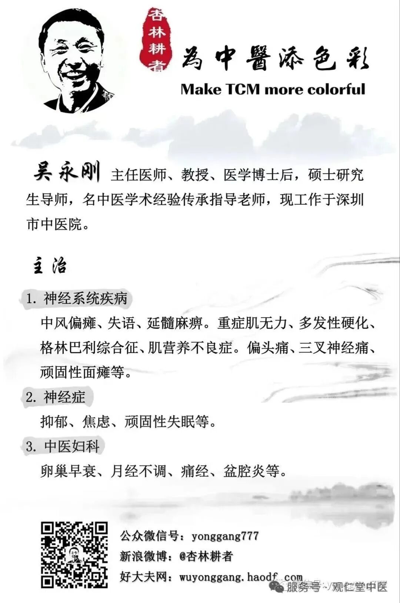

# 观仁堂中医公众号文章生成器

**一站式完成**：选题 → 写文章 → 配图 → 输出成品

## 配置

| 配置项 | 默认值 | 说明 |
|-------|--------|------|
| `output_dir` | `{当前工作目录}/articles` | 文章输出目录 |
| `api_key` | 见下方优先级 | 智谱 API Key |
| `skill_dir` | `~/.agents/skills/guanrentang-writer` | Skill 安装目录 |

### 输出目录设置

**方式一：使用默认路径**
- 不指定时，自动输出到 `{当前工作目录}/articles/`

**方式二：用户指定路径**
- 对话中说 "输出到 ~/Desktop/my-article" 或 "保存到 ./output"
- AI 会使用用户指定的路径

### API Key 配置优先级

1. 环境变量 `ZHIPU_API_KEY`
2. `{skill_dir}/.env` 文件中的 `ZHIPU_API_KEY`

### 首次使用配置

**步骤 1**：获取智谱 API Key
- 访问 [智谱开放平台](https://open.bigmodel.cn/) 注册并获取 API Key

**步骤 2**：选择配置方式（二选一）

| 方式 | 命令 | 说明 |
|-----|------|------|
| **方式一：环境变量** | 在 `~/.zshrc` 或 `~/.bashrc` 中添加 `export ZHIPU_API_KEY=your_key` | 全局可用，适合多个项目 |
| **方式二：.env 文件** | 在 skill 目录下创建 `.env` 文件，内容为 `ZHIPU_API_KEY=your_key` | 仅此 skill 使用，已加入 .gitignore |

> **执行前检查**：如果未配置 API Key，应提示用户选择上述方式之一配置后再继续

## 固定素材

公众号文章结尾需要两张固定图片（存放在 `{skill_dir}/assets/` 目录）：

| 文件名 | 用途 | 说明 |
|-------|------|------|
| `ending-decorative.jpg` | 装饰性结尾图 | "您点的每个赞，我都认真当成了喜欢" + 中国传统元素 |
| `ending-qrcode.jpg` | 关注二维码图 | "微信扫一扫 关注该公众号" + 公众号二维码 |

> **首次使用**：需要将这两张图片放入 `{skill_dir}/assets/` 目录

## 公众号图片尺寸规范

| 位置 | 推荐尺寸 | 比例 | GLM-Image size | 备注 |
|------|---------|------|----------------|------|
| 封面（大图） | 900×383 px | 2.35:1 | `1728x736` | AI 生成 |
| 封面（1:1） | 1280×1280 px | 1:1 | `1280x1280` | AI 生成 |
| 正文配图 | 1080×810 px | 4:3 | `1472x1088` | AI 生成 |
| 食疗图 | 1080×1080 px | 1:1 | `1280x1280` | AI 生成 |
| 结尾装饰图 | - | - | - | **固定素材** |
| 结尾关注图 | - | - | - | **固定素材** |

> **注意**：GLM-Image 尺寸需为 32 的整数倍，范围 512-2048

## 使用方式

| 用户说 | 效果 |
|-------|------|
| "帮我写一篇文章" | 自动选题，输出到默认目录 |
| "写个春季养生的" | 指定主题，输出到默认目录 |
| "随机写一篇" | 随机选题，输出到默认目录 |
| "输出到 ~/Desktop" | 使用指定输出目录 |
| "保存到 ./my-articles" | 使用相对路径 |
| "只写文章" | 写文章但不配图（草稿模式） |

---

## 执行流程

### Step 1: 选题

1. 用户指定主题 → 使用指定主题
2. 用户未指定 → 根据当前月份/节气自动选择（参考 STYLE.md 主题库）
3. 用户说"随机" → 从主题库随机选

**生成文件名**：使用日期前缀 + 文章标题（中文）
- 格式：`YYYY-MM-DD-文章标题.md`
- 例：`2026-03-22-清明养生：养肝明目，踏青防过敏.md`
- 例：`2026-03-19-回南天祛湿大作战.md`
- 图片目录：`images/文章标题/`（不带日期前缀）

### Step 2: 创建输出目录

```bash
# 创建文章和图片目录
mkdir -p "${OUTPUT_DIR}/images/${ARTICLE_TITLE}/"

# 复制固定素材到输出目录
cp -r "${SKILL_DIR}/assets" "${OUTPUT_DIR}/"
```

> **注意**：`SKILL_DIR` 默认为 `~/.agents/skills/guanrentang-writer`

### Step 3: 写文章 + 智能标记配图位置

按照 `STYLE.md` 中的风格撰写文章：
- 字数：1000-1500 字
- 结构：开头 → 原理 → 分点实操 → 注意事项 → 结尾
- 必须包含：中医理论 + 食疗方 + 穴位/注意事项
- 固定结尾语："您点的每个赞，我都认真当成了喜欢"

**智能配图规则**（根据文章内容自动判断）：

| 配图位置 | 触发条件 | 处理方式 |
|---------|---------|----------|
| **封面** | 必有 | AI 生成：提取标题关键词（≤8字）+ 季节 + 主题 |
| **原理配图** | 有"中医认为"/理论段落 | AI 生成：根据理论内容（如"肝主疏泄"→肝脏示意） |
| **实操配图** | 每个实操要点后 | AI 生成：根据要点内容（穴位→穴位图，食疗→食材图） |
| **食疗特写** | 有具体食疗方 | AI 生成：食疗方名称 + 主要食材 |
| **结尾图** | 必有 | **固定素材**：使用已复制的 `assets/` 目录图片 |

**配图数量控制**：
- 1000 字文章：3-4 张 AI 图 + 2 张固定结尾 = 5-6 张
- 1200 字文章：4-5 张 AI 图 + 2 张固定结尾 = 6-7 张
- 1500 字文章：5-6 张 AI 图 + 2 张固定结尾 = 7-8 张

**文章中标记图片位置**（使用 .jpg 格式）：

```markdown


## 正文开头
...


## 理论原理
...


## 食疗方推荐
...


您点的每个赞，我都认真当成了喜欢




```

> **重要**：
> - 内容配图（封面、配图、食疗）使用 AI 生成，alt 文本描述图片内容用于生成 Prompt
> - 结尾图使用固定素材，路径为 `./assets/`（相对于文章目录）

### Step 4: 保存文章草稿

先保存纯文本文章到 `${OUTPUT_DIR}/{文章标题}.md`

### Step 5: 自动生成配图

**执行时机**：文章写完并保存后，立即开始配图

**自动化流程**：

1. **解析文章**：提取所有 `` 格式的图片标记
2. **生成 Prompt**：根据图片类型和描述自动生成 Prompt
3. **调用 API**：依次生成每张图片
4. **下载保存**：下载到对应路径
5. **更新进度**：每完成一张报告进度

**Prompt 自动生成规则**：

```
图片标记格式：
- 封面： → 使用封面模板 + 提取文章标题（≤8字）+ 季节
- 配图： → 使用内容模板 + 描述内容
- 食疗： → 使用食疗模板 + 食疗方名称
- 结尾： → 跳过（已复制固定素材）

类型识别：
- 封面 → AI 生成
- 配图 → AI 生成
- 食疗 → AI 生成
- 结尾：装饰 → 跳过（使用 ./assets/ending-decorative.jpg）
- 结尾：关注 → 跳过（使用 ./assets/ending-qrcode.jpg）
```

**API 配置**：

| 配置项 | 值 |
|-------|-----|
| Endpoint | `https://open.bigmodel.cn/api/paas/v4/images/generations` |
| Model | `glm-image` |
| API Key | 优先级：环境变量 `ZHIPU_API_KEY` > `{skill_dir}/.env` |

**Prompt 模板**：

| 图片类型 | 尺寸 | Prompt 模板 |
|---------|------|------------|
| 封面 | `1728x736` | `微信公众号封面图，中国传统水墨画风格，顶部大标题"{标题}"，{季节}中医养生主题，淡雅清新，温暖色调，底部装饰性山水元素` |
| 配图 | `1472x1088` | `中医养生插画，{描述内容}，扁平化设计风格，温暖色调，简洁美观，适合公众号文章配图` |
| 食疗 | `1280x1280` | `中式美食摄影，{食疗方名称}，清新自然光线，干净背景，美食博客风格，高清细节` |

> **封面标题限制**：GLM-Image 文字渲染效果好，但标题建议控制在 8 字以内

**生成命令**（curl）：

```bash
# 1. 调用 API 生成图片
RESPONSE=$(curl -s -X POST "https://open.bigmodel.cn/api/paas/v4/images/generations" \
  -H "Authorization: Bearer $ZHIPU_API_KEY" \
  -H "Content-Type: application/json" \
  -d '{
    "model": "glm-image",
    "prompt": "微信公众号封面图...",
    "size": "1728x736"
  }')

# 2. 提取图片 URL
IMAGE_URL=$(echo "$RESPONSE" | jq -r '.data[0].url')

# 3. 下载图片到本地
curl -s -o "${OUTPUT_DIR}/images/${ARTICLE_TITLE}/cover.jpg" "$IMAGE_URL"
```

**错误处理**：

| 错误类型 | 处理方式 |
|---------|---------|
| API 429 限流 | 等待 5 秒后重试，最多 2 次 |
| API 其他错误 | 记录错误，跳过此图，继续下一张 |
| 下载失败 | 重试 1 次，仍失败则跳过 |

**间隔要求**：每张图片之间间隔 2 秒，避免触发限流

**进度报告**：

```
🎨 配图进度：1/5 封面 ✓
🎨 配图进度：2/5 肝脏示意 ✓
🎨 配图进度：3/5 枸杞菊花茶 ✓
🎨 配图进度：4/5 太冲穴 ✓
🎨 配图进度：5/5 结尾图（固定素材）✓
```

### Step 6: 输出结果

```
✅ 文章已完成！

📄 文章: ${OUTPUT_DIR}/{文章标题}.md
🖼️ 配图: X/Y 张成功
📁 图片: ${OUTPUT_DIR}/images/{文章标题}/
📁 素材: ${OUTPUT_DIR}/assets/

📊 统计: XXX 字，X 个标题
```

---

## 完整执行示例

```bash
# 1. 设置变量
SKILL_DIR="$HOME/.agents/skills/guanrentang-writer"
OUTPUT_DIR="${OUTPUT_DIR:-./articles}"
ARTICLE_TITLE="春季养肝全攻略"

# 2. 读取 API Key（优先级：环境变量 > skill 目录 .env）
if [ -z "$ZHIPU_API_KEY" ] && [ -f "$SKILL_DIR/.env" ]; then
  source "$SKILL_DIR/.env"
fi

# 3. 检查 API Key 是否配置
if [ -z "$ZHIPU_API_KEY" ]; then
  echo "❌ 未配置 ZHIPU_API_KEY"
  echo "请在 $SKILL_DIR/.env 中配置："
  echo "  ZHIPU_API_KEY=your_api_key_here"
  exit 1
fi

# 4. 创建目录
mkdir -p "${OUTPUT_DIR}/images/${ARTICLE_TITLE}/"

# 5. 复制固定素材到输出目录
cp -r "$SKILL_DIR/assets" "${OUTPUT_DIR}/"

# 6. 生成封面图
curl -s -X POST "https://open.bigmodel.cn/api/paas/v4/images/generations" \
  -H "Authorization: Bearer $ZHIPU_API_KEY" \
  -H "Content-Type: application/json" \
  -d '{"model":"glm-image","prompt":"微信公众号封面图，中国传统水墨画风格，顶部大标题\"春季养肝\"，春季中医养生主题，淡雅清新，温暖色调","size":"1728x736"}' \
  | jq -r '.data[0].url' \
  | xargs -I {} curl -s -o "${OUTPUT_DIR}/images/${ARTICLE_TITLE}/cover.jpg" "{}"

# 7. 等待 2 秒
sleep 2

# 8. 生成下一张图...
```

---

## 注意事项

1. 每张图片生成约需 10-20 秒，整篇文章配图约需 1-2 分钟
2. 封面标题控制在 8 字以内，避免文字渲染出错
3. 如果配图失败，仍然输出文章，但提示"配图部分失败"
4. 文件名和目录名可使用中文，但建议避免特殊字符

---

## 文件结构

```
{skill_dir}/
├── SKILL.md          # 本文件（执行指南）
├── STYLE.md          # 写作风格指南 + 主题库
├── .env              # API Key（不提交）
├── .gitignore
└── assets/           # 固定素材目录
    ├── ending-decorative.jpg  # 装饰性结尾图
    └── ending-qrcode.jpg      # 关注二维码图

{output_dir}/
├── {文章标题}.md      # 生成的文章
├── images/
│   └── {文章标题}/   # 文章配图
│       ├── cover.jpg
│       ├── content-1.jpg
│       └── ...
└── assets/           # 复制的固定素材
    ├── ending-decorative.jpg
    └── ending-qrcode.jpg
```

---

## 更新日志

### v1.1.0 (2026-03-22)
- 修复 Step 编号错误
- 统一图片路径逻辑
- 添加 `skill_dir` 变量，解决路径占位符问题
- 添加草稿模式（"只写文章"不配图）
- 优化文件结构说明
- 文件名添加日期前缀：`YYYY-MM-DD-文章标题.md`

### v1.0.0
- 初始版本
